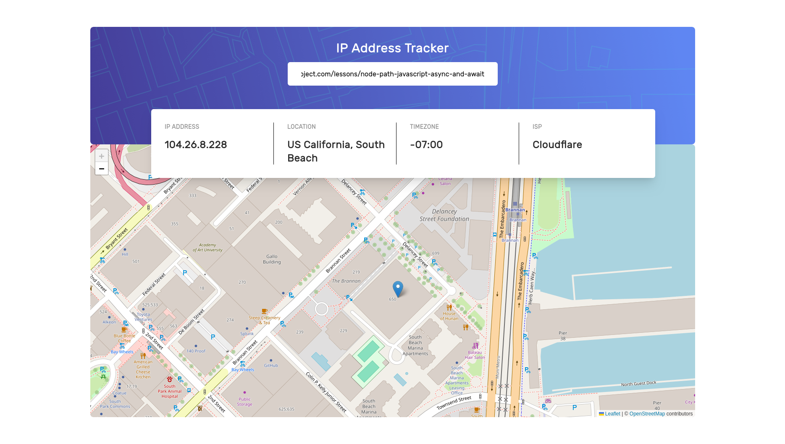

# Frontend Mentor - IP address tracker solution

This is a solution to the [IP address tracker challenge on Frontend Mentor](https://www.frontendmentor.io/challenges/ip-address-tracker-I8-0yYAH0). Frontend Mentor challenges help you improve your coding skills by building realistic projects.

## Table of contents

- [Overview](#overview)
  - [The challenge](#the-challenge)
  - [Screenshot](#screenshot)
  - [Links](#links)
- [My process](#my-process)
  - [Built with](#built-with)
  - [What I learned](#what-i-learned)
  - [Continued development](#continued-development)
  - [Useful resources](#useful-resources)

## Overview

### The challenge

Users should be able to:

- See their own IP address on the map on the initial page load
- Search for any IP addresses or domains and see the key information and location

### Screenshot



### Links

- Live Site URL: [Live Preview](https://azanra.github.io/ip-address-tracker/)

## My process

### Built with

- [React Leaflet](https://react-leaflet.js.org/) - Maps Library
- [React](https://reactjs.org/) - JS library
- [IP Geolocation API](https://geo.ipify.org/) - Geolocation API
- [lodash debounce](https://lodash.com/docs/4.17.15#debounce)

### What I learned

The requirement can be broken down like this

- Fetch own ip address on first render
- Fetch by using domain
- Fetch by ip address

Based off the documentation i read, those 3 have different params. to know which params to use, i need to know whether it is

- first time render
- it an ip address or domain

```js
export function isValidUrl(searchKeyword) {
  try {
    new URL(searchKeyword);
    return true;
  } catch {
    return false;
  }
}

export function isValidIpAddress(searchKeyword) {

  const ipv46_regex = // Regex that are too long....

  const isValid = ipv46_regex.test(searchKeyword);
  return isValid;
}
```

it will return true if the keyword that passed is either ip address or url

for first time render, i check it with useEffect, while im not 100% sure whether i should i use useEffect for this, from the definition of the docs, useEffect is used to synchronize to external system, the firstRender flag is used to decide which params to be used, i think this is enough reason to use it. also the reason is use ref based off my research it is to reduce unnecessary re-render

Then for the the keyword itself, i dont want to trigger fetch on every keystore, that why i use debounce for it, first i need to memoize and make the debounce funct persist and stable on each render with useMemo, because if not then on every render there would be new debounce function and it will update the keyword on keystore

```js
const debounceKeyword = useMemo(() => {
  console.log("debounce is memoized");
  return debounce(handleChange, 500);
}, [handleChange]);
```

The dependancy array here is similiar with how in useEffect, Since handleChange is state setter, it should be stable. and when it unmounting the debounce should not run, for that i useEffect to run the clean up

```js
useEffect(() => {
  return () => {
    console.log("Debounce is canceled");
    debounceKeyword.cancel();
  };
}, [debounceKeyword]);
```

And since debounceKeyword should be stable (it is memoized) it shouldn't run on each re-render

And for some reason for each new coordinate the map didn't get automatically recenter, for that i need to use built in method in leaflet to center the map on each new coordinate

```js
const map = useMap();

useEffect(() => {
  map.setView([lat, lng], DEFAULT_ZOOM);
  console.log("New coordinate!");

  return () => console.log("Cleaning up coordinate");
}, [lat, lng, map]);
```

map should be stable, because i tested it by running the effect like this. and it didn't re-run the effect (running the clean up function before running the effect again for those render)

```js
useEffect(() => {
  map;
  console.log("Value is tested");
  return () => console.log("Value is cleaned up");
});
```

### Continued development

- Convert it to typescript
- More practice creating custom hooks and useEffect, im still not sure when should i use effect, i often refer to the react docs. i just need more practice to know when it is appropriate to use it.

### Useful resources

- [Getting stated with leaflet react](https://medium.com/@timndichu/getting-started-with-leaflet-js-and-react-rendering-a-simple-map-ef9ee0498202) - Tutorial on how to stated with leaflet and react leaflet
- [Debounce Search](https://medium.com/nerd-for-tech/debounce-your-search-react-input-optimization-fd270a8042b) - How to apply debounce on search
